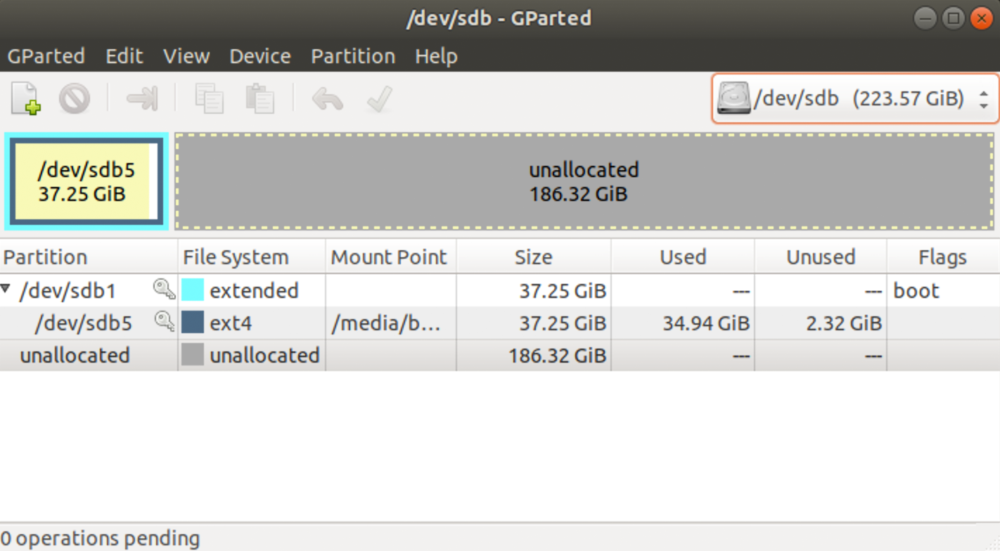
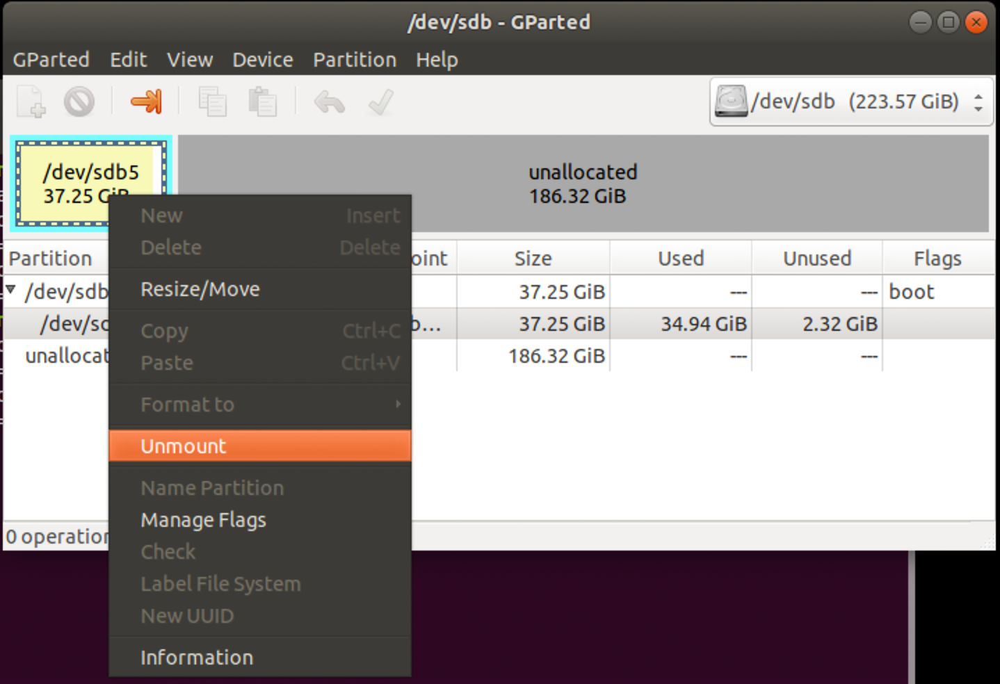
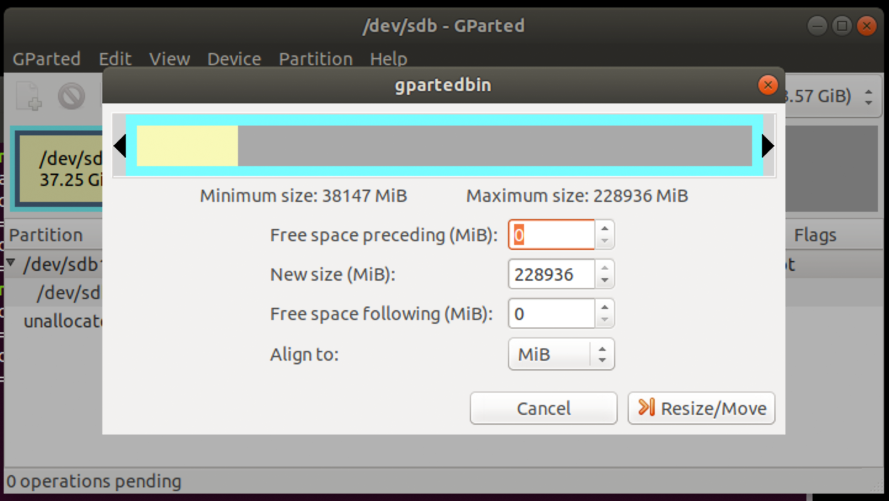
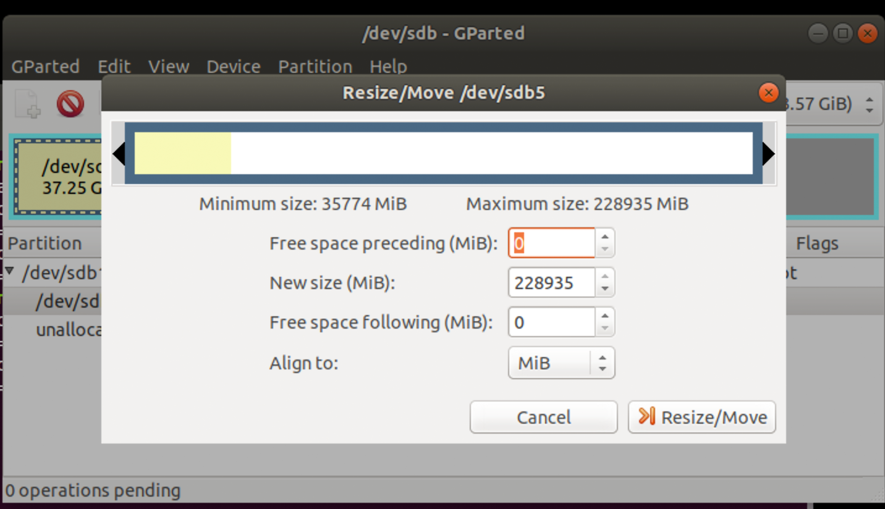
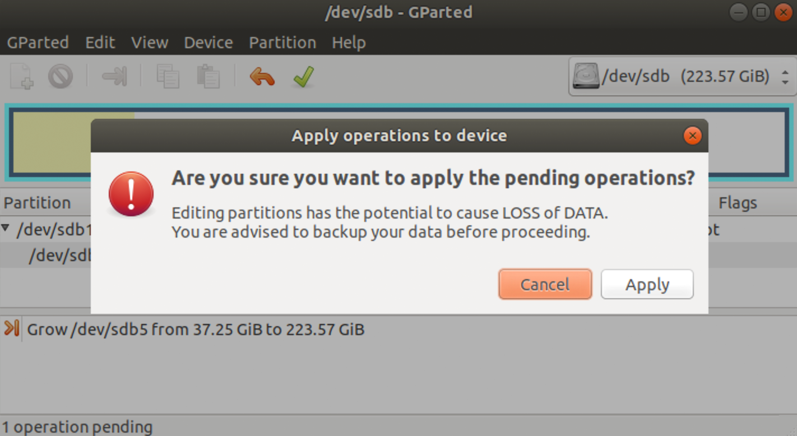

# Aumentar a partição do Linux

O SSD que foi fornecido tem muito espaço ainda  não alocado.  Este guia ajuda a redimensionar o volume Linux (partição `/`) para aproveitar melhor todo o disco.

**Importante: Você vai precisar plugar seu disco em um outro Linux para conseguir redimensioná-lo**

## Passo 1

Plugue o SSD em algum Linux já inicializado.

## Passo 2

Rode o comando a seguir:

    sudo gparted

Localize qual é o seu disco na aba superior direita. Você deve visualizar a instalação Linux ocupando uma fração pequena e todo o resto vazio, em cinza, como na figura a seguir

**Atenção:** As imagens mostrarão um SSD de 240GB mas seu disco pode ter outro tamanho.

## Passo 3

## Passo 4

## Passo 5

## Passo 6

## Passo 7

## Passo 8

