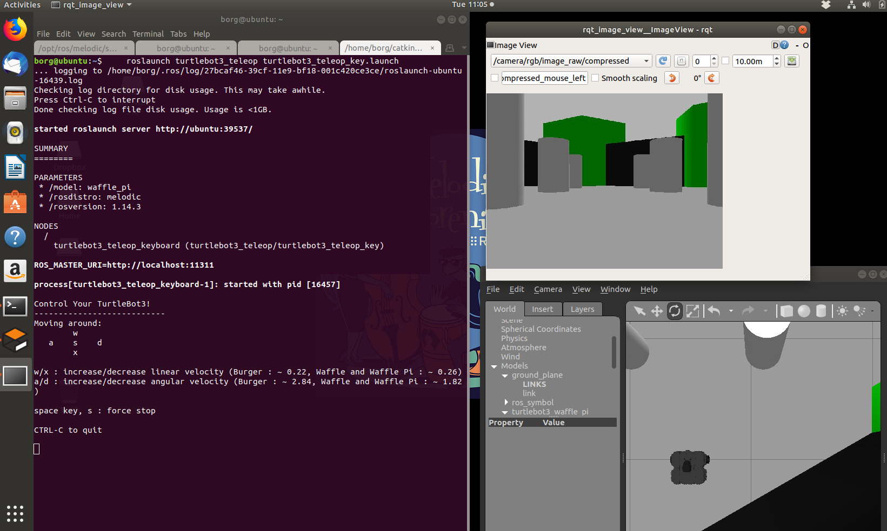
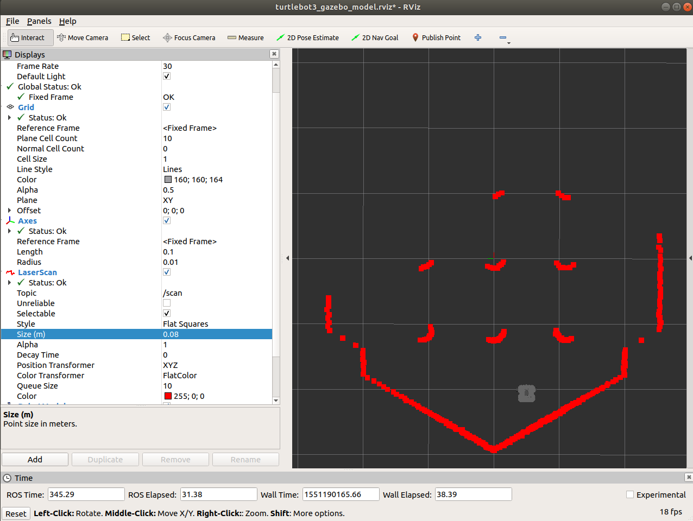

# Simulador de Turtlebot

Referência: Livro [ROS Robot Programming (disponível em PDFs)](http://community.robotsource.org/t/download-the-ros-robot-programming-book-for-free/51) Capítulos 5 e 6.


Abra um terminal. Dica: `Ctrl` `Alt` `T` abre terminais no Ubuntu


Vamos os certificar de que temos alguns softwares essenciais para o Turtlebot 3:

    sudo apt install ros-melodic-turtlebot3-msgs ros-melodic-ar-track-alvar ros-melodic-turtlebot3-applications-msgs


Vamos nos certificar de que já temos os softwares do `Turtlebot` (só precisa ser feito uma vez):

    cd ~/catkin_ws/src
    git clone https://github.com/ros-teleop/teleop_twist_keyboard.git    
    git clone https://github.com/ROBOTIS-GIT/turtlebot3.git
    git clone https://github.com/ROBOTIS-GIT/turtlebot3_applications.git  


    cd ~/catkin_ws
    catkin_make

## Eliminando conflitos de configuração com o robô real

Abra seu .bashrc e comente (colocando um caracter `#`) as linhas que definem as variáveis `ROS_IP` e `ROS_MASTER_URI`. Salve em seguida

Você pode editar usando o sublime:

    cd ~
    subl .bashrc

Exemplo de como ficou o arquivo:

    export IPBerry=192.168.0.110
    # export ROS_MASTER_URI="http://"$IPBerry":11311"
    # export ROS_IP=`hostname -I`
    export TURTLEBOT3_MODEL=waffle_pi
    
 Feche o terminal e abara um novo para carregar as alterações.


## Verificando se o simulador funciona


Tentar ver se o simulador do robô funciona:

    export TURTLEBOT3_MODEL=waffle_pi
    roslaunch turtlebot3_gazebo turtlebot3_world.launch

É comum que na primeira vez que se executa o simulador haja demora para este abrir porque os modelos 3D estão sendo baixados. Seu computador precisa ter acesso à internet para funcionar.

O script `simulador_turtle.sh` já contém estes comandos, para conveniência. 

De permissão para executar com os comandos a seguir;

    ~/catkin_ws/src/robot19/guides
    chmod +x simulador_turtle.sh
    ./simulador_turtle.sh


### Mudando o cenário

Podemos trocar o cenário mudando o `launch` file. Este abre com o robô em uma cas

    export TURTLEBOT3_MODEL=waffle_pi
    roslaunch turtlebot3_gazebo turtlebot3_house.launch


Em outro terminal podemos observar a visão que a câmera do robô proporciona:

    rqt_image_view

Ainda em outro, podemos ter o controle remoto. Pilote o robô pelo cenário:

    roslaunch turtlebot3_teleop turtlebot3_teleop_key.launch

Neste ponto sua tela deve estar parecida com a figura abaixo:




**Nota:** No simulador aconselhamos usar `export TURTLEBOT3_MODEL=waffle_pi`, mas para o robô físico é necessário ter `export TURTLEBOT3_MODEL=burger` . Esta sugestão é porque o *burger* simulado não tem câmera, e o *Waffle_Pi* tem. 

## Explorando as ferramentas do ROS

Vamos executar o `RViz`, que é uma ferramenta importante de monitoramento de dados de sensores e estado interno do robô, em um novo terminal, execute:

    roslaunch turtlebot3_gazebo turtlebot3_gazebo_rviz.launch

O resultado deve ser parecido com o da imagem abaixo:



### Observando comandos com o terminal

Digite o comando abaixo para receber updates sobre o scan laser do robô em tempo real:

    rostopic echo /scan

Para enviar comandos para o robô a partir do terminal, tente fazer:

    rostopic pub -r 10 /cmd_vel geometry_msgs/Twist  '{linear:  {x: 0.1, y: 0.0, z: 0.0}, angular: {x: 0.0,y: 0.0,z: 0.0}}'

O comando acima publica no tópico `cmd_vel` a uma taxa de $10Hz$ comandos para o robô andar 0.1m.

## Todos os tópicos

Para ver todos os tópicos suportados pelo robô em questão, sigite:

    rostopic list

No caso de estar conectado ao simulador, o output deve ser assim:
```bash
borg@ubuntu:~/catkin_ws/src/meu_projeto/scripts$ rostopic list
/camera/parameter_descriptions
/camera/parameter_updates
/camera/rgb/camera_info
/camera/rgb/image_raw
/camera/rgb/image_raw/compressed
/camera/rgb/image_raw/compressed/parameter_descriptions
/camera/rgb/image_raw/compressed/parameter_updates
/camera/rgb/image_raw/compressedDepth
/camera/rgb/image_raw/compressedDepth/parameter_descriptions
/camera/rgb/image_raw/compressedDepth/parameter_updates
/camera/rgb/image_raw/theora
/camera/rgb/image_raw/theora/parameter_descriptions
/camera/rgb/image_raw/theora/parameter_updates
/clock
/cmd_vel
/gazebo/link_states
/gazebo/model_states
/gazebo/parameter_descriptions
/gazebo/parameter_updates
/gazebo/set_link_state
/gazebo/set_model_state
/imu
/joint_states
/odom
/rosout
/rosout_agg
/scan
/tf

```
