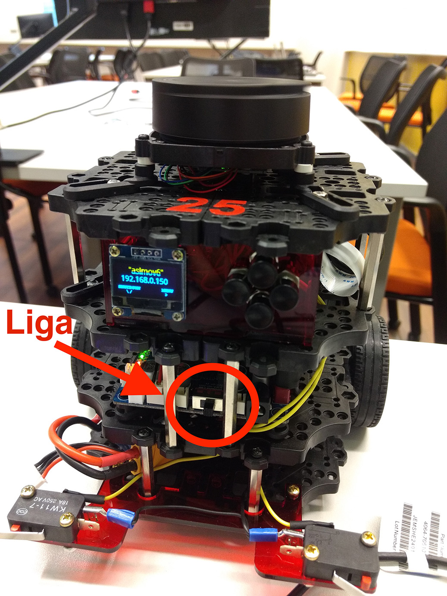

# Procedimentos do Turtlebot

## Como conectar a bateria

[https://www.youtube.com/watch?v=o5kFcaI2jHs&feature=youtu.be](https://www.youtube.com/watch?v=o5kFcaI2jHs&feature=youtu.be)

## Como ligar o robô

Na placa que fica no andar intermediário do robô ligue a chave liga-desliga.

Esta chave é mostrada na figura.

Agora vai iniciar o processo de boot do robô que dura cerca de dois minutos.

O boot estará terminado quando (a)  o robô tocar uma escala ascendente,  **e** (b) o endereço IP for visível na tela do robô **e** (c) o laser que fica no andar superior estiver girando

## Como mudar de rede

[https://www.youtube.com/watch?v=bGi5jZc8NPE&feature=youtu.be](https://www.youtube.com/watch?v=bGi5jZc8NPE&feature=youtu.be)

## Como desligar o robô

[https://www.youtube.com/watch?v=MMxhFo8dfZQ&feature=youtu.be](https://www.youtube.com/watch?v=MMxhFo8dfZQ&feature=youtu.be)

